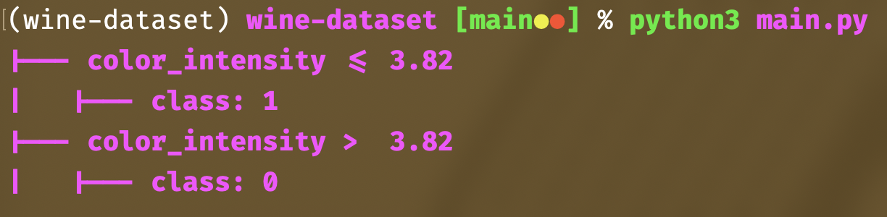
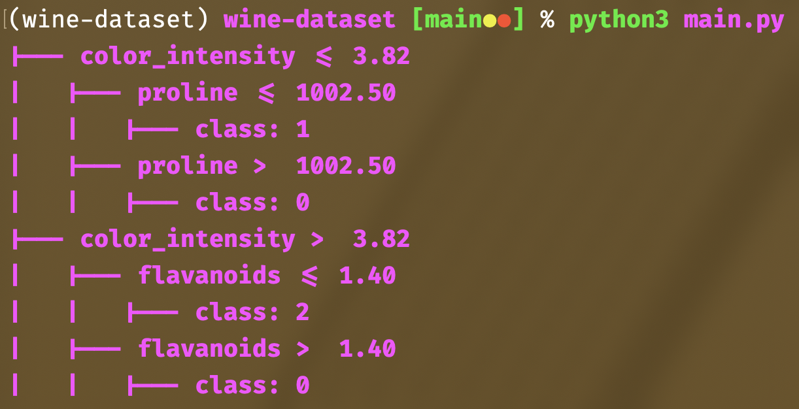
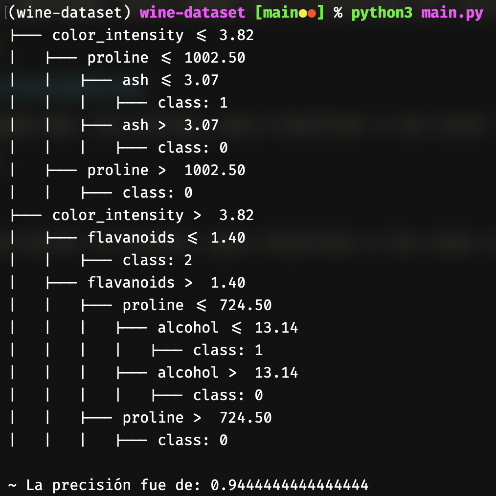

#+TITLE: Práctica de árboles de decisión
#+AUTHOR: Emanuel Alejandro Tavares Medina
#+SUBTITLE: Programación Lógica Funcional

* Descripción de la práctica de clasificación con árboles de decisión
Esta es una práctica que tiene los siguientes objetivos:

+ Aprender a entrenar un árbol de decisión como clasificador.
+ Comprender cómo los modelos generan reglas lógicas interpretables.
+ Explorar un dataset real (vino) y sus características.

Instrucciones paso a paso
+ Importar librerías necesarias:
  - from sklearn.datasets import load_wine
  - from sklearn.tree import DecisionTreeClassifier, export_text
  - from sklearn.model_selection import train_test_split

+ Estas librerías permiten:
+ load_wine → cargar la base de datos del vino.
  - DecisionTreeClassifier → crear el clasificador basado en reglas.
  - export_text → visualizar las reglas aprendidas.
  - train_test_split → dividir los datos en entrenamiento y prueba.
  - Cargar el dataset del vino:
    * wine = load_wine()
    * x, y = wine.data, wine.target
    * Donde:
  - x contiene las características químicas del vino (ej. alcohol, ácido málico, flavonoides, etc.)
  - y contiene la clase del vino (0, 1 o 2, que corresponden a 3 tipos de vino).
  - Dividir los datos en entrenamiento y prueba
    * 80% de los datos se usan para entrenar.
    * 20% se reservan para probar la precisión.
+ Crear y entrenar el clasificador
  - max_depth=2 limita la profundidad del árbol para que las reglas sean más fáciles de interpretar.

+ Exportar y visualizar las reglas simbólicas
  - rules = export_text(tree, feature_names=wine.feature_names)
  - print(rules)

* Después de cambiar el parámetro de max depth
A medida de que el número va creciendo desde el 1 al 3, en cada ejecución pude observar cómo la cifra de precisión aumenta conforme sube una cifra el parámetro 'max depth'. Los valores obtenidos fueron:

| max depth | Precisión obtenida |
|-----------+--------------------|
|         1 |           0.666... |
|         2 | 0.8611111111111112 |
|         3 |           0.944... |

Es aquí cuando a partir del 3 en el parámetro 'max depth' la precisión *se queda estancada en 0.944...*, porque después de probar con 4, 5, 6 y más valores, esa cifra no presentó cambios. Los que sí presentaron cambios fueron las reglas:

** Profundidad 1

Aparecen dos reglas, ambas referentes a la intensidad del color, menciona que si la intensidad del color es menor o igual a 3.82 es clase 1, y si es mayor a 3.82 entonces es clase 0.

** Profundidad 2

El árbol se va ampliando, ahora además de la intensidad del color está la prolina y los flavonoides. Además, existe una clase extra que es la 2, en donde entran los vinos con intensidad de color mayor a 3.82 y la cantidad de flavonoides es menor o igual a 1.40.

** Profundidad 3

file:anexos/profundidad3.png

Aparece una regla más: las cenizas, para clasificar a los vinos como clase 1 y 0 a los que obtienen una intensidad del color menor o igual a 3.82 y una cantidad de prolina menor o igual a 1002.50. En este punto ya es notable que el árbol conforme aumenta el valor de 'max depth' se va volviendo más preciso y esto lo demuestra el valor de precisión.

** Profundidad 4

Surge una regla extra: el alcohol, para clasificar a los vinos con intensidad de color mayor a 3.82, flavonoides mayor a 1.40 y prolina menor o igual a 724.50. Dependiendo de si el alcohol es menor o igual a 13.14 o mayor a esta cifra, clasificará al vino como clase 1 o 0.

** Profundidad 5

file:anexos/profundidad5.png

** Sin límite de profundidad

file:anexos/none.png

No se observan cambios visibles en comparación a la profundidad 4 y 5, parece que a partir del valor 4 no existen más cambios.

* Opiniones
Lo que he podido notar es que a medida de que el valor de la profundidad (max depth) va aumentando también aumenta la cantidad de reglas y el valor de precisión, a partir de la profundidad 3 el valor de precisión se queda estancado en 9.444... esto me da a entender que la precisión a partir de ese nivel es suficientemente buena como para que no existan incrementos de ese valor, no importa si pongo un valor más alto de profundidad o si no tiene restricciones en esta, siempre se queda así, pero si coloco profundidad 4 sí siguen habiendo cambios, se añade una regla pero me parece curioso que no haya por lo menos una poca de subida al nivel de precisión aún habiendo una regla extra que puede brindar más precisión; a partir de ahí no surgen más cambios, ni incrementando la profundidad ni sin restricciones de produndidad.
Resumidamente, a menos nivel de profundidad menos precisión y menos reglas; y a mayor nivel de profundidad más precisión y más reglas.

** ¿Puede mi base del conocimiento cumplir con los requisitos para utilizarse en un modelo de árbol de decisiones?

